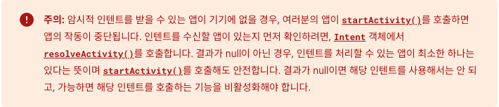

# Intent, PendingIntent

# Intent란?

안드로이드 앱은 **`Activity`**, **`Service`**, **`Broadcast Receiver`**, **`Content Provider`** 네가지 구성요소(컴포넌트)가 있고 I**ntent는 이러한 구성요소간 정보전달 역할을 수행하는 메세징 객체**이다

## 유형

### 명시적 인텐트

- 시작하고자 하는 액티비티, 서비스의 클래스 이름을 알고 있어야 하기 때문에 주로 **동일 앱 내부에서 구성요소간 데이터를 주고 받을때** 사용된다.
- 액티비티에서 다른 액티비티로 데이터를 전달 하거나 서비스를 시작하는 경우에 주로 사용

### 암시적 인텐트

- 구성요소의 이름 없이 수행할 작업을 선언하여 다른 앱의 구성요소가 이를 처리할 수 있도록 한다.
- **주로 외부 앱**간 작업을 위해 사용

<aside>
💡 암시적 인텐트에서 다른 앱을 찾는 원리

1. **인텐트를 실행**
2. **Manifest 파일 검사**: 시스템은 디바이스에 설치된 다른 앱의 AndroidManifest.xml 파일을 검사, 파일에는 앱이 지원하는 intent-filter가 정의되어 있다.
3. **일치하는 인텐트 필터 찾기**
4. **일치하는 액티비티 실행**: 시스템이 일치하는 인텐트 필터를 찾으면 해당 액티비티의 **`onCreate`** 메서드를 호출하고, 인텐트를 이 액티비티에 전달한다. 해당 앱의 액티비티가 실행되며, 앱은 해당 인텐트에 따라 동작을 수행
</aside>


## 사용예시

### 명시적 인텐드

- activity에서 servcie호출하기

```kotlin
// 1.Intent 인스턴스 생성
// Intent(Context, 구체적 Component 명시)
// Intent의 인스턴스 생성
private val serviceIntent: Intent = Intent(this, MyService::class.java)

// 2.전달할 데이터 담기
serviceIntent.putExtra("KEY", "DATA");

// 3.service 호출
reactContext.startService(serviceIntent)
```



- service에서 데이터 받기

```kotlin
class MyService : Service() {

		...
    override fun onStartCommand(intent: Intent?, flags: Int, startId: Int): Int {
        if (intent != null) {
						// 4. intent에서 데이터 추출
            String data = intent.getStringExtra("KEY");
        }
				...
    }
		...
}
```

### 암시적 인텐트 사용 예시

- 전화 화면 켜기

```kotlin
fun dialPhoneNumber(phoneNumber: String) {

		 // intent에는 ACTION_DIAL이라는 작업을 수행할 요소를 넘긴다.
		 // ACTION_DIAL을 하기위해서 AndroidManifest에 permiison도 선언되어있어야함
     val intent = Intent(Intent.ACTION_DIAL).apply {
         data = Uri.parse("tel:$phoneNumber")
     }

		 // resolveActivity()를 활용해 주어진 Intent를 이 디바이스에서 체크한다
     if (intent.resolveActivity(packageManager) != null) {
         startActivity(intent)
     }
}
```

참조

[https://developer.android.com/guide/components/intents-filters?hl=ko](https://developer.android.com/guide/components/intents-filters?hl=ko)

[https://www.crocus.co.kr/1521](https://www.crocus.co.kr/1521)
