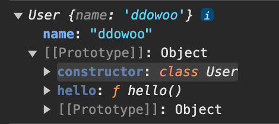

# Class

## class 기본 구조

- 클래스는 재정의 불가능

- 객체 생성 함수

  ```javascript
  class User {
    // 객체의 기본 상태를 설정해주는 생성자 메서드
    // 객체 프로퍼티 설정한다 생각
    // new에 의해 자동으로 호출로 객체 초기화 // ex> new User()
    constructor(name) {
      this.name = name;
    }

    // 메서드 선언
    hello() {
      return `hello ${this.name}`;
    }
  }
  ```

- `constructor`

  - class로 객체를 생성하고 초기화를 위한 메서드

  - 클래스 안에 하나만 존재 가능

  - 부보 클래스의 constructor를 호출하기 위해 `super`키워드 사용

- `static`

  - 정적 메서드 정의

  - 정적 메서드는 클래스의 인스턴스화 없이 호출

  - 인스턴스에서는 호출 불가

  - 클래스 자체와 관련된 작업, 유틸리티 함수, 공유 데이터 관리

- `extends` , `super`

  - 다른 클래스를 상속 받을 수 있음

  - 자식 클래스에 `constructor`가 있다면, `this`를 사용하기 전에 `super()`를 호출

  - es5에서 함수 기반의 클래스도 상속 가능

  - 예시 코드

    ```javascript
    class Shape {
      constructor() {
        this.width = 20;
        this.height = 20;
      }

      calcArea() {
        return this.width * this.height;
      }
    }

    class Square extends Shape {}

    class Triangle extends Shape {
      calcArea() {
        // super를 통해 Shape의 caclArea의 접근
        const squareArea = super.calcArea();
        return squareArea / 2;
      }
    }

    const suqare = new Square();
    console.log(suqare.calcArea());
    const triangle = new Triangle();
    console.log(triangle.calcArea());
    ```

- Private 필드

  - 변수와 메서드 앞에 `#`을 붙이면 프라이빗 필드에 정의되어 접근을 막을 수 있음

  - `in`키워드를 사용하면 private인지 아닌지 체크 할 수 잇음

    ```javascript
    class Foo {
      #brand = 100;
      static isFoo(obj) {
        return #brand in obj;
      }
    }

    const foo = new Foo();
    const foo2 = { brand: 100 };
    console.log('foo : ', Foo.isFoo(foo)); // true
    console.log('foo2 : ', Foo.isFoo(foo2)); // false
    ```

<br/>
<br/>

- `new User` 생성시

  - User라는 함수 생성 , 함수 본문 constructor

  - 메서드는 User.prototype에 저장 new User로 객체 생성시 User의 메서드를 [[prototype]]에 할당한다

  > [[prototype]]은 상속 prototype

  ```javascript
  const user = new User('ddowoo');
  console.log(user);
  ```

  

<br/><br/>

## 생성자 함수와 Class의 차이

- class 함수 내부 프로퍼티에는 `[[IsClassConstructor]]: true`가 존재

- 위 차이점 떄문에 new없이 클래스 호출시 에러

- 클래스 내 메서드들은 열거 불가능 (prototype 프로퍼티에 추가된 메서드의 enumerable 플래그는 false)

<br/><br/>

## getter , setter

- 정보 은닉, 코드 재사용성 등을 이유로 사용

- getter,setter를 설정하면 값을 할당하거나 가져올때 직접 하지 않고 반드시 getter, setter을 거쳐서 한다.

- get,set으로 값을 할당하거나 조회하는 경우 `_name`과 같이 private 프로퍼티 값으로 사용한다.

- get,set 예시

  ```javascript
  class User {
    constructor(name) {
      this._name = name;
    }

    get name() {
      return `나는 ${this._name}`;
    }
    set name(value) {
      if (value.length < 3) {
        alert('이름 최소 세글자');
        return;
      }
      this.anme = value;
    }
  }

  const shortUser = new User('dd');
  // alert('이름 최소 세글자') 얼럿창

  const user = new User('ddowoo');
  user.name; // '나는 ddowoo'
  ```

<br/><br/>

## 계산된 메서드 이름 [...]

```javascript
class User {
  ['say' + 'Hello']() {
    return 'Hello';
  }
}

new User().sayHello();
```

<br/><br/>

## 클래스 필드

- "키" = "값" 형식으로 클래스 필드 만들 수 있음

  > 최근 추가 기능, 구식 브라우저는 폴리필 필요할 수 있음

- `User.prototype`이 아닌 개별 객체에만 클래스 필드 생성

  ```javascript
  class User {
    name = 'ddowoo';
  }

  let user = new User();
  console.log(user.name); // ddowoo
  console.log(User.prototype.name); // undefined
  ```
