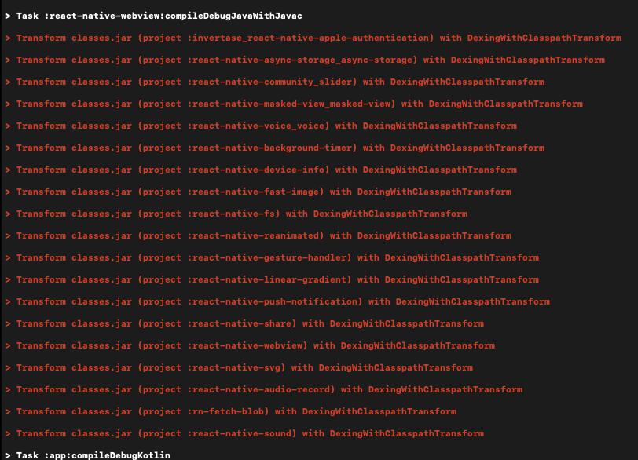

# React Native JDK 셋팅

android studio ide를 iguana로 바꾸고 프로젝트를 실행하는데 갑자기 못본 에러 발생

확인해보니 jdk가 문제였음

(jdk를 안건드린것 같은데 왜 여기서 문제가 생긴건지는 파악 못함)

처음 시작할때는 jdk가 뭔지 왜인지도 모르고 그냥 따라했는데 시작했는데 그래도

그래서 간멘에 rn셋팅환경에서 jdk확인 해보니 zulu jdk 17을 추천함

단 0.73버전 부터 추천하기 떄문에 현재 프로젝트가 0.71버전대인 나는 jdk11 로 셋팅하니 잘 해결됨

---

jdk와 함께 JAVA_HOME환경 변수도 기존 zulu openJDK가 아닌 다른게 잡혀있었음

해당 부분 수정하기 전 이런 에러를 맞음



```json
이후에 JAVA_HOME 환경 셋팅을 진행해야 합니다. JAVA_HOME을 업데이트 하기 위해, zshrc를 실행시킵니다. 하단의 코드를 입력후 저장합니다.

export JAVA_HOME=/Library/Java/JavaVirtualMachines/zulu-11.jdk/Contents/Home
```

---

환경변수 JAVA_HOME을 .bash_profile에 저장을 했는데도 계쏙해서 위에 오류가 생겨 찾아보니

다른 환경변수를 참조하고 있을 수도 있었다.

```bash
echo $SHELL
```

- **`/bin/bash`** - **`.bash_profile`**
- **`/bin/zsh0`-** **`.zshrc`**

나는 zshrc를 참조하고 있음

.zshrc 파일에

```bash
export JAVA_HOME=/Library/Java/JavaVirtualMachines/zulu-11.jdk/Contents/Home
```

환경 변수를 다시 설정해주니 잘 돌아간다
