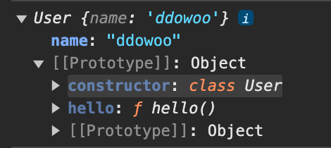

# Class

## class 기본 구조

- 객체 생성 함수

  ```javascript
  class User {
    // 객체의 기본 상태를 설정해주는 생성자 메서드
    // 객체 프로퍼티 설정한다 생각
    // new에 의해 자동으로 호출로 객체 초기화 // ex> new User()
    constructor(name) {
      this.name = name;
    }

    // 메서드 선언
    hello() {
      return `hello ${this.name}`;
    }
  }
  ```

- `constructor`

  - 객체의 기본 상태 설정해주는 생성자 메서드
  - 객체 프로퍼티 설정한다 생각
  - new에 의해 자동으로 호출 객체 초기화

- `new User` 생성시

  - User라는 함수 생성 , 함수 본문 constructor

  - 메서드는 User.prototype에 저장 new User로 객체 생성시 User의 메서드를 [[prototype]]에 할당한다

  > [[prototype]]은 상속 prototype

  ```javascript
  const user = new User('ddowoo');
  console.log(user);
  ```

  

<br/>

## 생성자 함수와 Class의 차이

- class 함수 내부 프로퍼티에는 `[[IsClassConstructor]]: true`가 존재

- 위 차이점 떄문에 new없이 클래스 호출시 에러

- 클래스 내 메서드들은 열거 불가능 (prototype 프로퍼티에 추가된 메서드의 enumerable 플래그는 false)

<br/>

## getter , setter

- 정보 은닉, 코드 재사용성 등을 이유로 사용

- getter,setter를 설정하면 값을 할당하거나 가져올때 직접 하지 않고 반드시 getter, setter을 거쳐서 한다.

- get,set으로 값을 할당하거나 조회하는 경우 `_name`과 같이 private 프로퍼티 값으로 사용한다.

- get,set 예시

  ```javascript
  class User {
    constructor(name) {
      this._name = name;
    }

    get name() {
      return `나는 ${this._name}`;
    }
    set name(value) {
      if (value.length < 3) {
        alert('이름 최소 세글자');
        return;
      }
      this.anme = value;
    }
  }

  const shortUser = new User('dd');
  // alert('이름 최소 세글자') 얼럿창

  const user = new User('ddowoo');
  user.name; // '나는 ddowoo'
  ```
