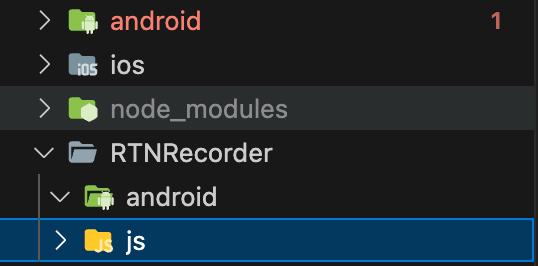
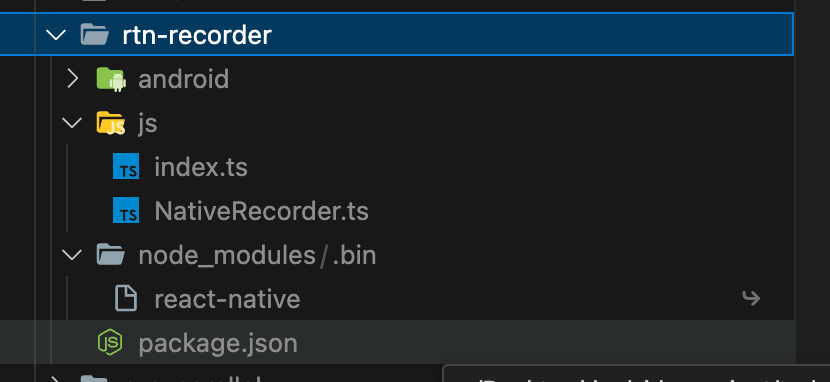
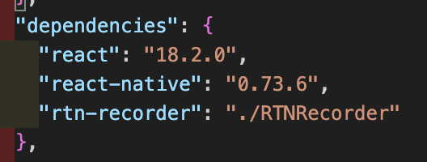

# React Native TURBO NATIVE MODULE 작업

## 터보 모듈

- 아직 실험적 기능이다.

- 인터페이스를 요구해 플랫폼 전반적으로 일관성 높은 코드를 요구함

- C++로 코드를 작성할 수 있어 플랫폼 간에 구현 중복 필요성 X ([C++로 Turbo Module 작성하기](https://github.com/reactwg/react-native-new-architecture/blob/main/docs/cxx-custom-types.md))

- 모듈을 지연로딩해 빠른 앱 시작 가능

- JSI를 활용해 브릿지보다 네이티브 코드와 JS 코드간 더 효율적 통신

  > `create-react-native-library`에서도 turbo module 스캐폴딩 지원

<br/>

### 1. 폴더설정

- 모듈을 앱에서 분리된 상태로 유지하려면 모듈을 앱과 별도로 정의한 다음 나중에 앱에 종속성으로 추가하는걸 추천

- 분리해서 관리하면 오픈소스로 릴리즈 하기도 좋다.

  > 문서는 프로젝트와 완전히 분리하지만 이 글에서는 루트프로젝트에서 작업

- native module 폴더명은 접두사 RTN(REACT-NATIVE) 권장

- 하위 폴더로 `android`, `ios`,`js` 생성 (예시는 android만 생성)

  

<br/>

### 2. Javascript 작성

- 뉴 아키텍쳐는 Flow 혹은 Typescript로 정의된 **인터페이스** 필요. (Codegen은 이를 기반으로 C++, Objective-C++, JAVA를 포함한 언어로 코드를 생성)

- 파일명 규칙

  - `Native<MODULE_NAME>`, ex) NativeRecorder.ts

  - Flow => `.js`,`.jsx` / Typescript => `.ts`,`.tsx`

- 파일은 `TurboModuleRegistrySpec`를 export 시켜야함

- `NativeRecorder.ts`

  ```typescript
  import { TurboModule, TurboModuleRegistry } from 'react-native';

  // 타입 이름은 반드시 Spec
  // 모든 파일은 터보 네이티브 모듈의 상세 내용을 가지고 있어야 한다.
  // 네이티브 모듈에서 override할 함수를 여기서 정의한다.
  export interface Spec extends TurboModule {
    record(): Promise<string>;
    stop(): Promise<string>;
  }

  // 모듈의 Name을 get의 파라미터로 넘겨주고 모듈을 가져 올 수 있으면 가져온다
  export default TurboModuleRegistry.get<Spec>('RTNRecorder') as Spec | null;
  ```

- `index.ts` (필수사항 x), js/Native<Module>.ts에 직접 접근해도 된다.

  ```typescript
  import NativeRecorder from './NativeRecorder';

  export const record = async () => {
    return await NativeRecorder?.record();
  };

  export const stop = async () => {
    return await NativeRecorder?.stop();
  };
  ```

  <br/> <br/>

### 3. 모듈 구성

- codegen을 위한 `package.json`에 config 작성

- `package.json`

  ```json
  {
    "name": "rtn-recorder",
    "version": "0.0.1",
    "description": "Record Turbo Module",
    "react-native": "js/index",
    "source": "js/index",
    "files": [
      "js",
      "android",
      "ios",
      "rtn-recorder.podspec",
      "!android/build",
      "!ios/build",
      "!**/__tests__",
      "!**/__fixtures__",
      "!**/__mocks__"
    ],
    "keywords": ["react-native", "ios", "android"],
    "license": "MIT",
    "peerDependencies": {
      "react": "*",
      "react-native": "*"
    },
    "codegenConfig": {
      "name": "RTNRecorderSpec",
      "type": "modules",
      "jsSrcsDir": "js",
      "android": {
        "javaPackageName": "com.rtnrecorder"
      }
    }
  }
  ```

- name : 라이브러리 이름
- type : module로 설정
- jsSrcsDir : 코드젠이 파싱할 js코드의 상대경로
- android.javaPackageName: 생성할 java 파일에 사용할 패키지명

 <br/>

### 4. Native 코드 작성

#### build.gradle 작성

- android 폴더 내에 `build.gradle` 생성

- `build.gradle`

  ```gradle
      buildscript {
      ext.safeExtGet = {prop, fallback ->
          rootProject.ext.has(prop) ? rootProject.ext.get(prop) : fallback
      }
      repositories {
          google()
          gradlePluginPortal()
      }
      dependencies {
          classpath("com.android.tools.build:gradle:7.3.1")
          classpath("org.jetbrains.kotlin:kotlin-gradle-plugin:1.7.22")
      }
      }

      apply plugin: 'com.android.library'
      apply plugin: 'com.facebook.react'
      apply plugin: 'org.jetbrains.kotlin.android'

      android {
          compileSdkVersion safeExtGet('compileSdkVersion', 33)
          // 패키지명
          namespace "com.rtncalculator"
      }

      repositories {
          mavenCentral()
          google()
      }

      dependencies {
          implementation 'com.facebook.react:react-native'
      }
  ```

#### Package파일 생성

- `TurboReactPackage` 인터페이스 상속

- `android/src/main/java/com/rtncalculator`경로에 생성

- RN은 ReactPackage 인터페이스를 활용하여 Native Module 클래스를 이해한다.

- `RecorderPackage.kt`

  ```kotlin
  package com.rtncalculator;

  import com.facebook.react.TurboReactPackage
  import com.facebook.react.bridge.NativeModule
  import com.facebook.react.bridge.ReactApplicationContext
  import com.facebook.react.module.model.ReactModuleInfoProvider

  class CalculatorPackage : TurboReactPackage() {
      override fun getModule(name: String?, reactContext: ReactApplicationContext): NativeModule? = null

      override fun getReactModuleInfoProvider(): ReactModuleInfoProvider? = null
      }

  ```

#### Module.kt 파일 생성 Android

- `RecorderModule.kt`

  ```kotlin
  package com.rtnrecorder

  import com.facebook.react.bridge.Promise
  import com.facebook.react.bridge.ReactApplicationContext
  // NativeCalculatorSpec은 자바스크립트 파일명(NativeRecorder)을 기준으로 생성
  import com.rtnrecorder.NativeRecorderSpec

  class RecorderModule(reactContext: ReactApplicationContext) : NativeRecorderSpec(reactContext) {

      override fun getName() = NAME

      // JS Spec에서 정의한 함수
      override fun record(promise: Promise) {
          promise.resolve("recording")
      }

      override fun stop(promise: Promise) {
          promise.resolve("stop")
      }

      // JS TurboModuleRegistry.get에서 호출하는 ModuleName
      companion object {
              const val NAME = "RTNRecorder"
      }
  }
  ```

#### RecorderPackage.kt 파일 수정

- `RecorderPackage.kt`

  ```kotlin
  package com.rtnrecorder;

  import com.facebook.react.TurboReactPackage
  import com.facebook.react.bridge.NativeModule
  import com.facebook.react.bridge.ReactApplicationContext
  import com.facebook.react.module.model.ReactModuleInfo // 추가
  import com.facebook.react.module.model.ReactModuleInfoProvider

  class RecorderPackage : TurboReactPackage() {
      override fun getModule(name: String, reactContext: ReactApplicationContext): NativeModule? =
          if (name == RecorderModule.NAME) {
              RecorderModule(reactContext)
          } else {
              null
          }

      override fun getReactModuleInfoProvider() = ReactModuleInfoProvider {
          mapOf(
              RecorderModule.NAME to ReactModuleInfo(
              RecorderModule.NAME,
              RecorderModule.NAME,
              false, // canOverrideExistingModule
              false, // needsEagerInit
              true, // hasConstants
              false, // isCxxModule
              true // isTurboModule
              )
          )
      }
  }

  ```

<br/>

### 5. 프로젝트에 Turbo Module 의존성 설치

- 명령어

  ```
  yarn add ./RTNRecorder
  ```

- node_modules

  

- package.json

  

- 프로젝트의 `android/gradle.properties`위치에서 `newArchEnabled`를 `true`로 설정

</br>

### 6. 프로젝트 활용하기

```typescript
import {record, stop} from 'rtn-recorder';

...

const App = () => {

    const onPressRecord = async () => {
        const status = await record();
        setStatus(status);
    };

    const onPressStop = async () => {
        const status = await stop();
        setStatus(status);
    };

...

}

```

<br/>
<br/>

### 참조

[Turbo Native Module Docs](https://github.com/reactwg/react-native-new-architecture/blob/main/docs/turbo-modules.md)
